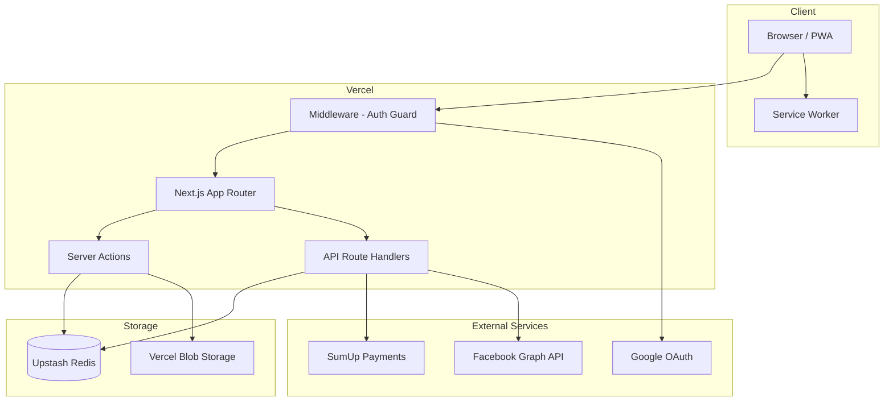
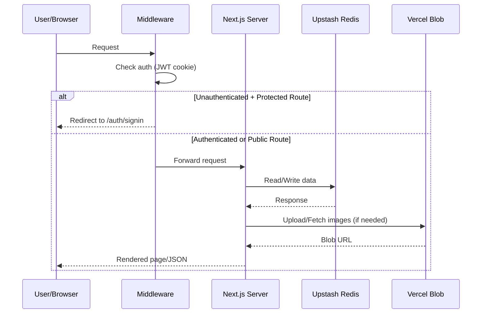
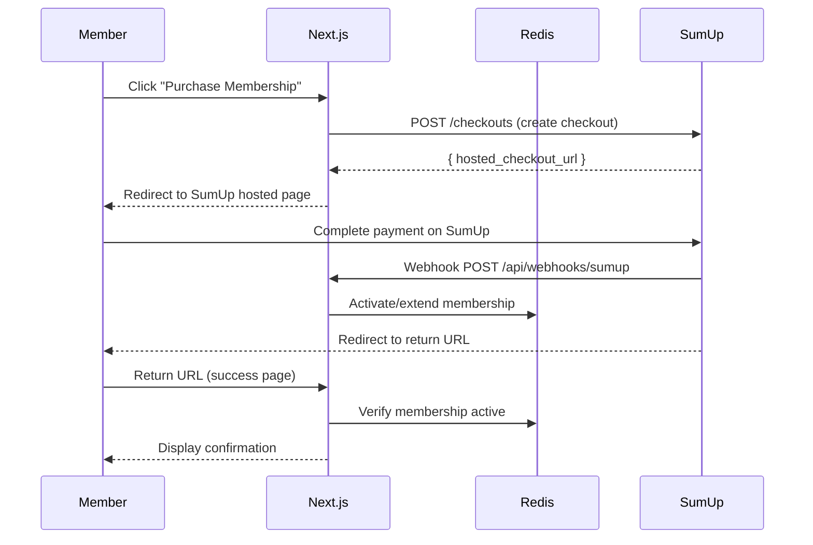
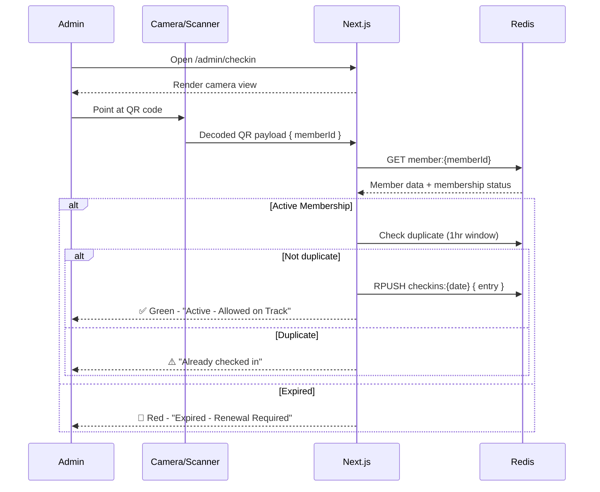

# Design Document: RC Drift Track Platform (Penthouse Drift)

## Overview

Penthouse Drift is a full-stack web application and PWA for managing an RC drift track community. The system provides membership management with QR-based check-in, a car showcase with calibration sharing, shell design voting, a gear ratio calculator, and Facebook page integration.

### Key Technical Decisions

| Decision | Choice | Rationale |
|----------|--------|-----------|
| Framework | Next.js 14+ (App Router) | Server Components, Server Actions, API Routes, built-in image optimization |
| Hosting | Vercel | Native Next.js support, edge functions, Blob storage integration |
| Authentication | Auth.js (NextAuth v5) + Google OAuth | First-class App Router support, JWT sessions, minimal config |
| Database | Upstash Redis | Serverless-compatible, HTTP-based SDK, per-request billing on Vercel |
| Payments | SumUp Hosted Checkout | PCI-compliant hosted page, simple redirect-based flow |
| Image Storage | Vercel Blob | CDN-backed, client uploads up to 500MB, integrated with Vercel |
| Facebook | Graph API v19+ | Page feed read via `/{page-id}/feed`, publish via `/{page-id}/feed` POST |
| PWA | @ducanh2912/next-pwa | Active fork with App Router support, Workbox under the hood |
| QR Codes | `qrcode` npm package | Lightweight, generates PNG/SVG, no external service needed |

## Architecture

### High-Level System Architecture



### Request Flow



### Directory Structure

```
penthouseDrift/
├── src/
│   ├── app/
│   │   ├── (public)/              # Public routes (landing, sign-in)
│   │   │   ├── page.tsx           # Landing page
│   │   │   └── auth/
│   │   │       └── signin/page.tsx
│   │   ├── (protected)/           # Auth-required routes
│   │   │   ├── dashboard/page.tsx
│   │   │   ├── cars/
│   │   │   │   ├── page.tsx       # Car profiles list
│   │   │   │   ├── [carId]/page.tsx
│   │   │   │   └── new/page.tsx
│   │   │   ├── showcase/
│   │   │   │   ├── page.tsx       # Shell showcase gallery
│   │   │   │   └── submit/page.tsx
│   │   │   ├── calculator/page.tsx
│   │   │   ├── newsfeed/page.tsx
│   │   │   └── profile/page.tsx
│   │   ├── (admin)/               # Admin-only routes
│   │   │   ├── admin/
│   │   │   │   ├── members/page.tsx
│   │   │   │   ├── checkin/page.tsx
│   │   │   │   ├── showcase/page.tsx
│   │   │   │   └── facebook/page.tsx
│   │   ├── api/
│   │   │   ├── auth/[...nextauth]/route.ts
│   │   │   ├── webhooks/
│   │   │   │   └── sumup/route.ts
│   │   │   ├── checkin/scan/route.ts
│   │   │   └── facebook/
│   │   │       ├── feed/route.ts
│   │   │       └── publish/route.ts
│   │   ├── layout.tsx
│   │   └── manifest.ts           # Web App Manifest (dynamic)
│   ├── lib/
│   │   ├── auth.ts               # Auth.js config
│   │   ├── redis.ts              # Upstash Redis client
│   │   ├── blob.ts               # Vercel Blob helpers
│   │   ├── sumup.ts              # SumUp API client
│   │   ├── facebook.ts           # Facebook Graph API client
│   │   ├── qr.ts                 # QR code generation
│   │   └── validators.ts         # Zod schemas
│   ├── actions/                   # Server Actions
│   │   ├── membership.ts
│   │   ├── cars.ts
│   │   ├── calibration.ts
│   │   ├── showcase.ts
│   │   └── checkin.ts
│   ├── components/
│   │   ├── ui/                   # Shared UI primitives
│   │   ├── auth/
│   │   ├── cars/
│   │   ├── showcase/
│   │   ├── calculator/
│   │   └── admin/
│   └── types/
│       └── index.ts
├── public/
│   ├── icons/                    # PWA icons
│   └── sw.js                     # Generated service worker
├── next.config.ts
├── middleware.ts
├── tailwind.config.ts
└── package.json
```

## Components and Interfaces

### Authentication (Auth.js v5)

```typescript
// src/lib/auth.ts
import NextAuth from "next-auth";
import Google from "next-auth/providers/google";
import { redis } from "./redis";

const ADMIN_EMAILS: string[] = JSON.parse(
  process.env.ADMIN_EMAILS || "[]"
);

export const { handlers, auth, signIn, signOut } = NextAuth({
  providers: [
    Google({
      clientId: process.env.GOOGLE_CLIENT_ID!,
      clientSecret: process.env.GOOGLE_CLIENT_SECRET!,
    }),
  ],
  session: { strategy: "jwt", maxAge: 7 * 24 * 60 * 60 }, // 7-day expiry
  callbacks: {
    async jwt({ token, user, account }) {
      if (user) {
        token.role = ADMIN_EMAILS.includes(user.email ?? "")
          ? "admin"
          : "member";
        // Persist member to Redis on first login
        await redis.hset(`member:${token.sub}`, {
          id: token.sub,
          email: user.email,
          name: user.name,
          image: user.image,
          role: token.role,
          createdAt: Date.now(),
        });
      }
      return token;
    },
    async session({ session, token }) {
      session.user.id = token.sub!;
      session.user.role = token.role as "admin" | "member";
      return session;
    },
  },
});
```

```typescript
// middleware.ts
import { auth } from "@/lib/auth";
import { NextResponse } from "next/server";

export default auth((req) => {
  const { pathname } = req.nextUrl;
  const isAuth = !!req.auth;
  const isAdmin = req.auth?.user?.role === "admin";

  // Public routes
  if (pathname === "/" || pathname.startsWith("/auth")) {
    return NextResponse.next();
  }

  // Require auth for all other routes
  if (!isAuth) {
    return NextResponse.redirect(new URL("/auth/signin", req.url));
  }

  // Admin routes require admin role
  if (pathname.startsWith("/admin") && !isAdmin) {
    return NextResponse.redirect(new URL("/dashboard", req.url));
  }

  return NextResponse.next();
});

export const config = {
  matcher: ["/((?!_next/static|_next/image|favicon.ico|icons|api/webhooks).*)"],
};
```

### Redis Client (Upstash)

```typescript
// src/lib/redis.ts
import { Redis } from "@upstash/redis";

export const redis = new Redis({
  url: process.env.UPSTASH_REDIS_REST_URL!,
  token: process.env.UPSTASH_REDIS_REST_TOKEN!,
  retry: {
    retries: 5,
    backoff: (retryCount) =>
      Math.min(1000 * Math.pow(2, retryCount), 30000),
  },
});
```

### SumUp Payment Integration

```typescript
// src/lib/sumup.ts
const SUMUP_API = "https://api.sumup.com/v0.1";

interface CreateCheckoutParams {
  memberId: string;
  amount: number;
  currency: string;
  description: string;
  returnUrl: string;
}

export async function createCheckout(params: CreateCheckoutParams) {
  const response = await fetch(`${SUMUP_API}/checkouts`, {
    method: "POST",
    headers: {
      Authorization: `Bearer ${process.env.SUMUP_API_KEY}`,
      "Content-Type": "application/json",
    },
    body: JSON.stringify({
      checkout_reference: `membership_${params.memberId}_${Date.now()}`,
      amount: params.amount,
      currency: params.currency,
      description: params.description,
      merchant_code: process.env.SUMUP_MERCHANT_CODE,
      redirect_url: params.returnUrl,
      metadata: { memberId: params.memberId },
    }),
  });
  return response.json();
}
```

### Facebook Graph API Client

```typescript
// src/lib/facebook.ts
const FB_API = "https://graph.facebook.com/v19.0";

export async function getPageFeed(limit = 20) {
  const pageId = process.env.FACEBOOK_PAGE_ID;
  const token = process.env.FACEBOOK_PAGE_ACCESS_TOKEN;

  const response = await fetch(
    `${FB_API}/${pageId}/feed?fields=message,created_time,full_picture,attachments&limit=${limit}&access_token=${token}`,
    { next: { revalidate: 900 } } // Cache for 15 minutes
  );
  return response.json();
}

export async function publishPost(message: string, imageUrls?: string[]) {
  const pageId = process.env.FACEBOOK_PAGE_ID;
  const token = process.env.FACEBOOK_PAGE_ACCESS_TOKEN;

  if (imageUrls && imageUrls.length > 0) {
    // Upload photos first, then create multi-photo post
    const photoIds = await Promise.all(
      imageUrls.map(async (url) => {
        const res = await fetch(`${FB_API}/${pageId}/photos`, {
          method: "POST",
          headers: { "Content-Type": "application/json" },
          body: JSON.stringify({
            url,
            published: false,
            access_token: token,
          }),
        });
        const data = await res.json();
        return data.id;
      })
    );
    // Publish with attached photos
    const res = await fetch(`${FB_API}/${pageId}/feed`, {
      method: "POST",
      headers: { "Content-Type": "application/json" },
      body: JSON.stringify({
        message,
        attached_media: photoIds.map((id) => ({ media_fbid: id })),
        access_token: token,
      }),
    });
    return res.json();
  }

  // Text-only post
  const res = await fetch(`${FB_API}/${pageId}/feed`, {
    method: "POST",
    headers: { "Content-Type": "application/json" },
    body: JSON.stringify({ message, access_token: token }),
  });
  return res.json();
}
```

### QR Code Generation

```typescript
// src/lib/qr.ts
import QRCode from "qrcode";

export async function generateQRCode(memberId: string): Promise<string> {
  const payload = JSON.stringify({ memberId, version: 1 });
  const dataUrl = await QRCode.toDataURL(payload, {
    width: 300,
    margin: 2,
    color: { dark: "#000000", light: "#FFFFFF" },
  });
  return dataUrl;
}

export async function generateQRCodeBuffer(memberId: string): Promise<Buffer> {
  const payload = JSON.stringify({ memberId, version: 1 });
  return QRCode.toBuffer(payload, { width: 300, margin: 2 });
}
```

### Payment Flow



### Check-In Flow (QR Scan)



## Data Models

All data is stored in Upstash Redis using a key-pattern approach with Hashes, Sorted Sets, Sets, and Lists.

### Key Schema

| Entity | Key Pattern | Type | Fields / Structure |
|--------|------------|------|-------------------|
| Member Profile | `member:{userId}` | Hash | id, email, name, image, role, qrCode, createdAt |
| Membership | `membership:{userId}` | Hash | userId, status, purchasedAt, expiresAt, paymentRef |
| Membership Index (active) | `memberships:active` | Sorted Set | score=expiresAt, member=userId |
| Membership Index (all) | `memberships:all` | Sorted Set | score=createdAt, member=userId |
| QR Code Mapping | `qr:{memberId}` | String | QR data URL (base64 PNG) |
| Check-In Record | `checkin:{userId}:{date}` | Hash | userId, adminId, timestamp, method |
| Check-In Dedup | `checkin:dedup:{userId}` | String | "1" with TTL 3600s |
| Check-Ins by Date | `checkins:{YYYY-MM-DD}` | List | JSON stringified check-in entries |
| Car Profile | `car:{carId}` | Hash | carId, userId, name, images (JSON array of blob URLs), createdAt |
| Member Cars Index | `member:{userId}:cars` | Set | carId values |
| Calibration Setup | `calibration:{calibrationId}` | Hash | calibrationId, carId, userId, name, camber, toe, caster, boost, customParams (JSON), createdAt |
| Car Calibrations Index | `car:{carId}:calibrations` | Set | calibrationId values |
| Calibration Share | `share:{shareId}` | Hash | shareId, calibrationId, userId, createdAt, active |
| Shell Showcase Entry | `shell:{shellId}` | Hash | shellId, userId, imageUrl, description, voteCount, createdAt |
| Shell Showcase Index | `shells:all` | Sorted Set | score=createdAt (descending), member=shellId |
| Shell Votes | `shell:{shellId}:voters` | Set | userId values |
| Shell Leaderboard | `shells:leaderboard` | Sorted Set | score=voteCount, member=shellId |
| Weekly Winner | `shells:winner:{year}:{week}` | String | shellId |
| Winners Index | `shells:winners` | Sorted Set | score=yearWeekNumeric, member=shellId |
| Gear Ratio (saved) | `car:{carId}:ratios` | List | JSON { spur, pinion, ratio } |
| Facebook Cache | `facebook:feed` | String | JSON array of posts, refreshed every 15 min |
| Facebook Cache Timestamp | `facebook:feed:updated` | String | Unix timestamp |

### TypeScript Type Definitions

```typescript
// src/types/index.ts

export interface Member {
  id: string;
  email: string;
  name: string;
  image: string | null;
  role: "admin" | "member";
  qrCode: string | null;
  createdAt: number;
}

export interface Membership {
  userId: string;
  status: "active" | "expired";
  purchasedAt: number;
  expiresAt: number;
  paymentRef: string;
}

export interface CheckIn {
  userId: string;
  adminId: string;
  timestamp: number;
  method: "qr" | "manual";
  memberName: string;
}

export interface CarProfile {
  carId: string;
  userId: string;
  name: string;          // 1-50 chars
  images: string[];      // Vercel Blob URLs, 1-10 items
  createdAt: number;
}

export interface CalibrationSetup {
  calibrationId: string;
  carId: string;
  userId: string;
  name: string;          // 1-50 chars
  camber: number;        // -15.0 to +15.0 degrees
  toe: number;           // -10.0 to +10.0 degrees
  caster: number;        // -15.0 to +15.0 degrees
  boost: number;         // 0 to 100 integer percentage
  customParams: CustomParam[];  // up to 10
  createdAt: number;
}

export interface CustomParam {
  name: string;          // 1-30 chars
  value: string;         // 1-30 chars
}

export interface ShellEntry {
  shellId: string;
  userId: string;
  imageUrl: string;      // Vercel Blob URL
  description: string;   // 0-500 chars
  voteCount: number;
  createdAt: number;
}

export interface GearRatio {
  spur: number;          // 30-130
  pinion: number;        // 10-60
  ratio: number;         // spur/pinion, 2 decimal places
}

export interface FacebookPost {
  id: string;
  message: string;
  createdTime: string;
  images: string[];
  hasUnsupportedContent: boolean;
}
```

### Validation Schemas (Zod)

```typescript
// src/lib/validators.ts
import { z } from "zod";

export const carProfileSchema = z.object({
  name: z.string().min(1).max(50),
  images: z.array(z.string().url()).min(1).max(10),
});

export const calibrationSchema = z.object({
  name: z.string().min(1).max(50),
  camber: z.number().min(-15).max(15),
  toe: z.number().min(-10).max(10),
  caster: z.number().min(-15).max(15),
  boost: z.number().int().min(0).max(100),
  customParams: z
    .array(
      z.object({
        name: z.string().min(1).max(30),
        value: z.string().min(1).max(30),
      })
    )
    .max(10)
    .optional()
    .default([]),
});

export const shellSubmissionSchema = z.object({
  imageUrl: z.string().url(),
  description: z.string().max(500).optional().default(""),
});

export const gearRatioSchema = z.object({
  spur: z.number().int().min(30).max(130),
  pinion: z.number().int().min(10).max(60),
});

export const facebookPostSchema = z.object({
  message: z.string().min(1).max(63206),
  imageUrls: z
    .array(z.string().url())
    .max(4)
    .optional()
    .default([]),
});
```


### Image Storage Strategy (Vercel Blob)

All user-uploaded images (car profiles, shell showcase) are stored in Vercel Blob with public access. The flow uses client-side uploads for files up to 5MB to avoid Vercel's 4.5MB serverless body limit.

```typescript
// src/lib/blob.ts
import { put, del } from "@vercel/blob";

export async function uploadImage(
  file: File,
  folder: string
): Promise<string> {
  const blob = await put(`${folder}/${file.name}`, file, {
    access: "public",
    addRandomSuffix: true,
  });
  return blob.url;
}

export async function deleteImage(url: string): Promise<void> {
  await del(url);
}
```

For client uploads (avoiding serverless body size limits):

```typescript
// src/app/api/upload/route.ts
import { handleUpload, type HandleUploadBody } from "@vercel/blob/client";
import { auth } from "@/lib/auth";

export async function POST(request: Request) {
  const session = await auth();
  if (!session) {
    return Response.json({ error: "Unauthorized" }, { status: 401 });
  }

  const body = (await request.json()) as HandleUploadBody;

  const jsonResponse = await handleUpload({
    body,
    request,
    onBeforeGenerateToken: async (pathname) => {
      return {
        allowedContentTypes: ["image/jpeg", "image/png", "image/webp"],
        maximumSizeInBytes: 5 * 1024 * 1024, // 5MB
        tokenPayload: JSON.stringify({ userId: session.user.id }),
      };
    },
    onUploadCompleted: async ({ blob, tokenPayload }) => {
      // Could record blob URL in Redis here if needed
    },
  });

  return Response.json(jsonResponse);
}
```

### PWA Configuration

```typescript
// src/app/manifest.ts
import type { MetadataRoute } from "next";

export default function manifest(): MetadataRoute.Manifest {
  return {
    name: "Penthouse Drift",
    short_name: "PH Drift",
    start_url: "/dashboard",
    display: "standalone",
    theme_color: "#1a1a2e",
    background_color: "#1a1a2e",
    icons: [
      { src: "/icons/icon-192.png", sizes: "192x192", type: "image/png" },
      { src: "/icons/icon-512.png", sizes: "512x512", type: "image/png" },
    ],
  };
}
```

Service Worker configuration via `next.config.ts`:

```typescript
// next.config.ts
import withPWA from "@ducanh2912/next-pwa";

const nextConfig = withPWA({
  dest: "public",
  register: true,
  skipWaiting: true,
  runtimeCaching: [
    {
      urlPattern: /^https:\/\/.*\.vercel-storage\.com\/.*/i,
      handler: "CacheFirst",
      options: {
        cacheName: "blob-images",
        expiration: { maxEntries: 200, maxAgeSeconds: 7 * 24 * 60 * 60 },
      },
    },
    {
      urlPattern: /\/api\//,
      handler: "NetworkFirst",
      options: {
        cacheName: "api-cache",
        expiration: { maxEntries: 50, maxAgeSeconds: 300 },
      },
    },
  ],
})({
  // Standard Next.js config
  images: {
    remotePatterns: [
      { protocol: "https", hostname: "*.public.blob.vercel-storage.com" },
      { protocol: "https", hostname: "*.fbcdn.net" },
    ],
  },
});

export default nextConfig;
```

### Membership Expiry Mechanism

Since Upstash Redis supports TTL but the requirements say data should not have implicit TTLs, membership status is computed at read time:

```typescript
// src/actions/membership.ts
export function isMembershipActive(membership: Membership): boolean {
  return membership.expiresAt > Date.now();
}

export function getRemainingDays(membership: Membership): number {
  const remaining = membership.expiresAt - Date.now();
  return Math.max(0, Math.floor(remaining / (1000 * 60 * 60 * 24)));
}
```

A Vercel Cron Job (runs every minute) updates the `memberships:active` sorted set by removing expired members:

```typescript
// src/app/api/cron/expire-memberships/route.ts
import { redis } from "@/lib/redis";

export async function GET(request: Request) {
  // Verify cron secret
  const authHeader = request.headers.get("authorization");
  if (authHeader !== `Bearer ${process.env.CRON_SECRET}`) {
    return Response.json({ error: "Unauthorized" }, { status: 401 });
  }

  const now = Date.now();
  // Remove members whose expiresAt score is less than now
  const expired = await redis.zrangebyscore("memberships:active", 0, now);

  for (const userId of expired) {
    await redis.hset(`membership:${userId}`, { status: "expired" });
    await redis.zrem("memberships:active", userId);
  }

  return Response.json({ expired: expired.length });
}
```

### API Routes Structure

| Route | Method | Auth | Purpose |
|-------|--------|------|---------|
| `/api/auth/[...nextauth]` | GET/POST | Public | Auth.js handlers |
| `/api/webhooks/sumup` | POST | Webhook secret | SumUp payment confirmation |
| `/api/checkin/scan` | POST | Admin | Process QR scan result |
| `/api/upload` | POST | Member | Vercel Blob client upload token |
| `/api/facebook/feed` | GET | Member | Fetch cached Facebook feed |
| `/api/facebook/publish` | POST | Admin | Publish to Facebook page |
| `/api/share/[shareId]` | GET | Member | View shared calibration |
| `/api/cron/expire-memberships` | GET | Cron secret | Expire memberships |
| `/api/cron/facebook-sync` | GET | Cron secret | Refresh Facebook feed cache |

### Environment Variables

```
# Auth
GOOGLE_CLIENT_ID=
GOOGLE_CLIENT_SECRET=
AUTH_SECRET=
ADMIN_EMAILS=["admin@example.com"]

# Redis
UPSTASH_REDIS_REST_URL=
UPSTASH_REDIS_REST_TOKEN=

# Vercel Blob
BLOB_READ_WRITE_TOKEN=

# SumUp
SUMUP_API_KEY=
SUMUP_MERCHANT_CODE=
SUMUP_WEBHOOK_SECRET=

# Facebook
FACEBOOK_PAGE_ID=
FACEBOOK_PAGE_ACCESS_TOKEN=

# Cron
CRON_SECRET=

# App
NEXT_PUBLIC_APP_URL=https://penthousedrift.vercel.app
```

## Correctness Properties

*A property is a characteristic or behavior that should hold true across all valid executions of a system — essentially, a formal statement about what the system should do. Properties serve as the bridge between human-readable specifications and machine-verifiable correctness guarantees.*

### Property 1: Role Assignment Correctness

*For any* authenticated user email address, if the email is present in the admin allow-list the assigned role SHALL be "admin", otherwise the assigned role SHALL be "member".

**Validates: Requirements 1.4**

### Property 2: Membership List Sorting

*For any* list of members with varying membership statuses and expiration dates, the sorted output SHALL place all active members before all expired members, and within each group members SHALL be ordered by expiration date ascending.

**Validates: Requirements 2.1**

### Property 3: Member Search Filtering

*For any* search query string and any list of members, the filtered results SHALL contain exactly those members whose name or email contains the query as a case-insensitive substring, and no others.

**Validates: Requirements 2.4**

### Property 4: QR Code Round-Trip

*For any* member ID, generating a QR code and then decoding it SHALL produce a payload containing the original member ID. Additionally, generating the QR code for the same member ID multiple times SHALL produce identical output.

**Validates: Requirements 3.1, 3.3**

### Property 5: Check-In Rejects Expired Members

*For any* member with an expired membership and any check-in method (QR or manual), attempting to check them in SHALL NOT create a check-in record in Redis.

**Validates: Requirements 4.3, 5.3**

### Property 6: Check-In Records Correct Fields

*For any* member with an active membership and any check-in method (QR or manual), performing a check-in SHALL create a record containing the member ID, admin ID, current timestamp, and the correct method string ("qr" or "manual").

**Validates: Requirements 4.4, 5.2**

### Property 7: Check-In Deduplication Within One Hour

*For any* member, if a check-in has already been recorded within the last hour, subsequent check-in attempts for the same member SHALL NOT create additional check-in records.

**Validates: Requirements 4.6**

### Property 8: New Membership Duration

*For any* purchase timestamp T, a newly created membership SHALL have an expiration date of exactly T + 2,419,200,000 milliseconds (28 days).

**Validates: Requirements 6.1, 7.2**

### Property 9: Remaining Days Calculation

*For any* membership with expiration timestamp E and current time N where E > N, the displayed remaining days SHALL equal floor((E - N) / 86,400,000).

**Validates: Requirements 6.3**

### Property 10: Membership Renewal Extension

*For any* active membership with current expiration E, renewing SHALL set the new expiration to exactly E + 2,419,200,000 milliseconds (28 days from current expiration, not from now).

**Validates: Requirements 6.5, 7.3**

### Property 11: Failed Payment Preserves State

*For any* member's current membership state, if a payment attempt fails or is cancelled, the membership state SHALL remain identical to its state before the payment attempt.

**Validates: Requirements 7.4**

### Property 12: Car Profile Validation

*For any* car profile input, the system SHALL accept it if and only if the name is between 1 and 50 characters and there are between 1 and 10 images each in JPEG, PNG, or WebP format and no larger than 5MB.

**Validates: Requirements 8.1**

### Property 13: Car Deletion Cascades to Calibrations

*For any* car profile with N associated calibration setups, deleting the car profile SHALL also remove all N calibration setups from Redis, leaving zero calibrations referencing that car.

**Validates: Requirements 8.4**

### Property 14: Calibration Setup Validation

*For any* calibration setup input, the system SHALL accept it if and only if: the name is 1-50 characters, camber is between -15.0 and +15.0, toe is between -10.0 and +10.0, caster is between -15.0 and +15.0, boost is an integer between 0 and 100, and custom parameters (if any) number at most 10 with each name 1-30 chars and each value 1-30 chars.

**Validates: Requirements 9.1, 9.3, 9.4, 9.5**

### Property 15: Shared Calibration Access Control

*For any* shared calibration link, unauthenticated access SHALL result in a redirect to sign-in, and after the share is revoked, any subsequent access SHALL return a "no longer available" response.

**Validates: Requirements 10.1, 10.5**

### Property 16: Shared Calibration Data Completeness

*For any* shared calibration setup, the view SHALL display the setup name, associated car profile name, creator's display name, and all stored parameters.

**Validates: Requirements 10.2, 10.3**

### Property 17: Shell Showcase Gallery Ordering

*For any* set of shell showcase entries, the gallery view SHALL display them ordered by submission date descending (newest first).

**Validates: Requirements 11.2**

### Property 18: Shell Showcase Entry Completeness

*For any* shell showcase entry, the rendered view SHALL include the image, description, author name, vote count, and submission date.

**Validates: Requirements 11.3**

### Property 19: Vote Toggle Behavior

*For any* shell showcase entry with vote count N and any member (who is not the entry's author), voting once SHALL set the count to N+1 and voting a second time SHALL set the count back to N.

**Validates: Requirements 12.1, 12.2**

### Property 20: Self-Vote Prevention

*For any* shell showcase entry, the entry's author SHALL NOT be able to cast a vote on their own entry; attempting to do so SHALL leave the vote count unchanged.

**Validates: Requirements 12.3**

### Property 21: Leaderboard Sort Order

*For any* set of shell showcase entries, the leaderboard SHALL be sorted by vote count descending; where two entries have equal vote counts, the entry with the earlier submission date SHALL rank higher.

**Validates: Requirements 12.4**

### Property 22: Weekly Winner Uniqueness

*For any* calendar week, at most one shell showcase entry SHALL hold the winner designation. Selecting a new winner in the same week SHALL remove the badge from the previous winner.

**Validates: Requirements 13.3, 13.4**

### Property 23: Gear Ratio Computation

*For any* valid spur teeth count (integer 30-130) and pinion teeth count (integer 10-60), the computed gear ratio SHALL equal Math.round((spur / pinion) * 100) / 100.

**Validates: Requirements 14.1**

### Property 24: Gear Ratio Input Validation

*For any* input that is non-numeric, zero, negative, or outside the permitted ranges (spur: 30-130, pinion: 10-60), the calculator SHALL reject the input and display a validation error without computing a ratio.

**Validates: Requirements 14.3**

### Property 25: Facebook Post Text Truncation

*For any* Facebook post with text content, if the text exceeds 500 characters it SHALL be truncated to 500 characters with a truncation indicator appended; if 500 characters or fewer it SHALL be displayed in full.

**Validates: Requirements 15.3**

### Property 26: Facebook Publish Validation

*For any* post composition input, the system SHALL accept it if and only if the text is between 1 and 63,206 characters and images (if any) number at most 4, each in JPEG or PNG format and no larger than 4MB.

**Validates: Requirements 16.4, 16.5**

### Property 27: Redis Write Confirmation

*For any* write operation to Redis, the system SHALL confirm success before acknowledging to the user; if the write does not complete within 5 seconds, the system SHALL treat it as failed and return a timeout error.

**Validates: Requirements 18.2**

### Property 28: Redis Retry with Exponential Backoff

*For any* sequence of Redis connection failures, the retry delays SHALL follow exponential backoff with initial delay 1 second, doubling each attempt, capped at 30 seconds maximum, for at most 5 attempts.

**Validates: Requirements 18.3**


## Error Handling

### Error Handling Strategy

The application uses a layered error handling approach:

| Layer | Strategy | User Impact |
|-------|----------|-------------|
| Validation (Zod) | Reject invalid input before processing | Inline field errors displayed immediately |
| Redis Operations | Retry with exponential backoff (1s, 2s, 4s, 8s, 16s cap at 30s, max 5 attempts) | Loading spinner → timeout error with retry button |
| External APIs (SumUp, Facebook) | Single attempt with timeout, graceful degradation | Error message with actionable guidance |
| Auth Failures | Redirect to sign-in | Clear error message on sign-in page |
| Image Upload | Client-side validation + server rejection | File-specific error messages |
| Network (PWA) | Service Worker cache fallback | Offline indicator + cached content |

### Error Response Format

```typescript
// Consistent error shape for Server Actions
type ActionResult<T> =
  | { success: true; data: T }
  | { success: false; error: string; field?: string };
```

### Specific Error Scenarios

**Redis Connection Failure:**
- Retry with exponential backoff (initial 1s, max 30s, 5 attempts)
- After all retries exhausted: display "Service temporarily unavailable" with retry button
- Write operations: never acknowledge success without Redis confirmation
- Read operations: display error with manual retry option

**SumUp Payment Failure:**
- Payment cancelled by user: return to membership page with "Payment cancelled" message
- Payment declined: display "Payment could not be completed" with option to retry
- Webhook delivery failure: SumUp retries webhooks; idempotent processing on our side

**Facebook API Failure:**
- Read (feed): serve cached posts with "Feed may not be current" notice
- Write (publish): retain draft in form state, display error reason from API, allow re-submit
- Token expiry: log error, display admin notice to refresh token

**Image Upload Failure:**
- Client-side: file too large or wrong format → immediate rejection before upload
- Server-side: Vercel Blob error → display "Upload failed" with retry option
- Partial failure (multi-image): reject entire submission, user must re-upload all

**QR Code Scan Errors:**
- Invalid/unrecognized QR data: "This QR code is not associated with any member"
- Camera permission denied: prompt user to grant camera access
- Decode failure: "Could not read QR code, please try again"

## Testing Strategy

### Testing Framework and Tools

| Tool | Purpose |
|------|---------|
| Vitest | Unit tests and property-based tests (via `fast-check`) |
| fast-check | Property-based testing library |
| React Testing Library | Component integration tests |
| MSW (Mock Service Worker) | API mocking for integration tests |
| Playwright | End-to-end tests |

### Test Structure

```
tests/
├── unit/                    # Pure function tests
│   ├── validators.test.ts
│   ├── membership.test.ts
│   ├── gear-ratio.test.ts
│   └── qr-code.test.ts
├── properties/              # Property-based tests
│   ├── role-assignment.prop.test.ts
│   ├── membership-sorting.prop.test.ts
│   ├── search-filter.prop.test.ts
│   ├── qr-roundtrip.prop.test.ts
│   ├── checkin.prop.test.ts
│   ├── membership-duration.prop.test.ts
│   ├── calibration-validation.prop.test.ts
│   ├── vote-toggle.prop.test.ts
│   ├── leaderboard-sort.prop.test.ts
│   ├── gear-ratio.prop.test.ts
│   ├── text-truncation.prop.test.ts
│   └── facebook-validation.prop.test.ts
├── integration/             # API and component integration
│   ├── auth-flow.test.ts
│   ├── payment-webhook.test.ts
│   ├── checkin-scan.test.ts
│   └── facebook-feed.test.ts
└── e2e/                     # End-to-end (Playwright)
    ├── auth.spec.ts
    ├── membership.spec.ts
    ├── car-profile.spec.ts
    └── showcase.spec.ts
```

### Property-Based Testing Configuration

- Library: `fast-check`
- Minimum iterations: 100 per property
- Each property test is tagged with a comment referencing the design property
- Tag format: `// Feature: rc-drift-track-platform, Property {N}: {title}`

Example property test structure:

```typescript
// tests/properties/gear-ratio.prop.test.ts
import { describe, it, expect } from "vitest";
import * as fc from "fast-check";
import { computeGearRatio, validateGearInput } from "@/lib/calculator";

describe("Gear Ratio Properties", () => {
  // Feature: rc-drift-track-platform, Property 23: Gear Ratio Computation
  it("computes correct ratio for all valid inputs", () => {
    fc.assert(
      fc.property(
        fc.integer({ min: 30, max: 130 }), // spur
        fc.integer({ min: 10, max: 60 }),  // pinion
        (spur, pinion) => {
          const result = computeGearRatio(spur, pinion);
          const expected = Math.round((spur / pinion) * 100) / 100;
          expect(result).toBe(expected);
        }
      ),
      { numRuns: 100 }
    );
  });

  // Feature: rc-drift-track-platform, Property 24: Gear Ratio Input Validation
  it("rejects all invalid inputs", () => {
    fc.assert(
      fc.property(
        fc.oneof(
          fc.integer({ min: -100, max: 29 }),  // below spur range
          fc.integer({ min: 131, max: 500 }), // above spur range
          fc.constant(0)
        ),
        (invalidSpur) => {
          const result = validateGearInput(invalidSpur, 20);
          expect(result.valid).toBe(false);
        }
      ),
      { numRuns: 100 }
    );
  });
});
```

### Unit Testing

Unit tests cover specific examples and edge cases not covered by property tests:
- Auth callback handling (session creation, role assignment edge cases)
- SumUp webhook signature verification
- Facebook post formatting for specific content types
- Image validation (specific file headers, corrupt files)
- PWA manifest field correctness
- Component rendering (status indicators, error states)

### Integration Testing

Integration tests verify component interactions with mocked external services:
- Auth flow end-to-end with mocked Google OAuth
- Payment webhook processing with mocked Redis
- QR scan flow with mocked camera input
- Facebook feed caching with mocked Graph API responses

### End-to-End Testing

Playwright tests cover critical user journeys:
- Sign in → view dashboard → purchase membership
- Admin sign in → scan QR → verify check-in recorded
- Create car profile → add calibration → share link
- Submit to shell showcase → vote → view leaderboard
